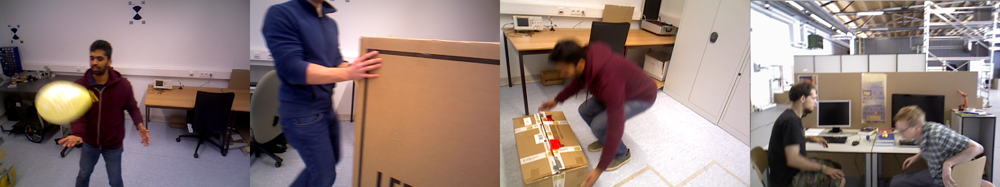

# Dynamic scenes

|  |
|:--:|
| Frames from sequences used for evaluating performance in dynamic environments   from the [Bonn](https://www.ipb.uni-bonn.de/data/rgbd-dynamic-dataset/) and [TUM RGB-D](https://vision.in.tum.de/data/datasets/rgbd-dataset/download) datasets  |

Most SLAM algorithms have an in-built assumption that the environment will be static. In reality, the vast majority of SLAM use-cases take place 
in environments with dynamic objects. Dynamic objects are not only a perturbation to be dealt with but often the most important elements of a scene:
humans, vehicles, tools, agents able to modify other aspects of the environment. It is thus crucial for a robotic system that they are recognized and modelled appropriately.
From the point of view of camera localization, the static world assumption implies that all changes from one frame to another can be accounted for by a single causal factor: camera position.
Systems which work under this assumption will therefore include changes produced by dynamic objects when computing the camera pose, and perform erroneously. 

Algorithms with RGB-D support are evaluated on the 24 dynamic sequences of the Bonn dataset and the 8 dynamic sequences 
of the _freiburg3_ TUM dataset. 

 Balloon 

 Balloon 2 

 

 Balloon tracking  

 

 Balloon tracking 2 

 

 Crowd 

 

 Crowd 2 

 

 Crowd 3 

 

 Moving nonobstructing box 

 

 Moving nonobstructing box 2 

 

 Person tracking 

 

 Person tracking 2 

 

 Moving obstructing box 

 

 Moving obstructing box 2  

 

 Placing nonobstructing box 

 

 Placing nonobstructing box 2 

 

 Placing nonobstructing box 3 

 

 Placing obstructing box 

 

 Removing nonobstructing box 

 

 Removing nonobstructing box 2 

 

 Removing Obstructing Box 

 

 Synchronous 

 

 Synchronous2 

 

